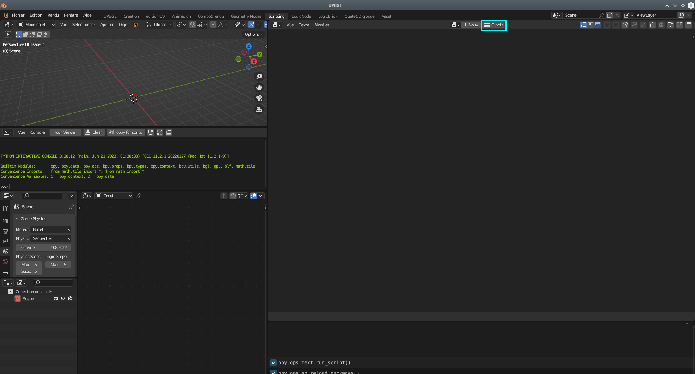
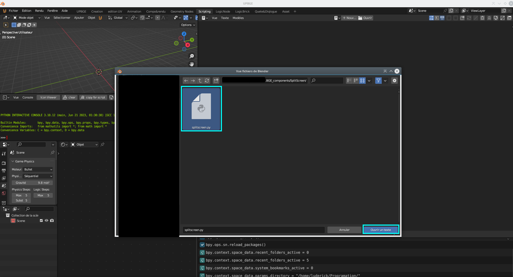
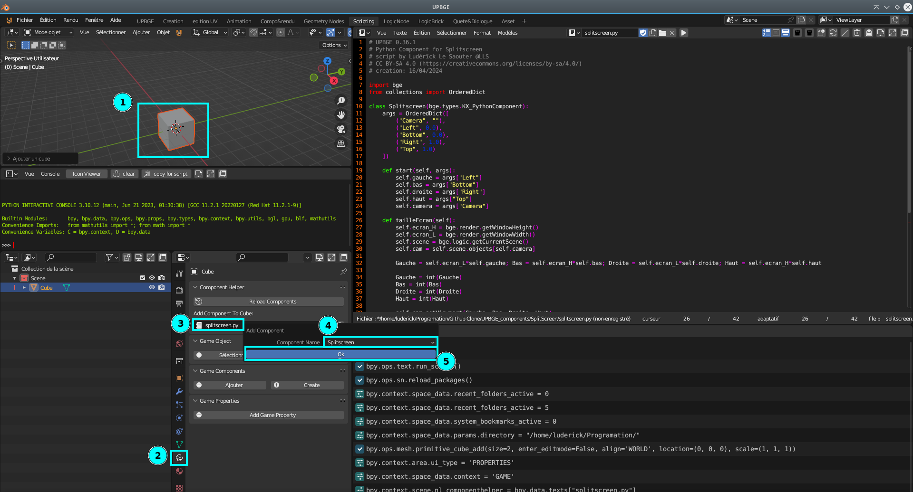
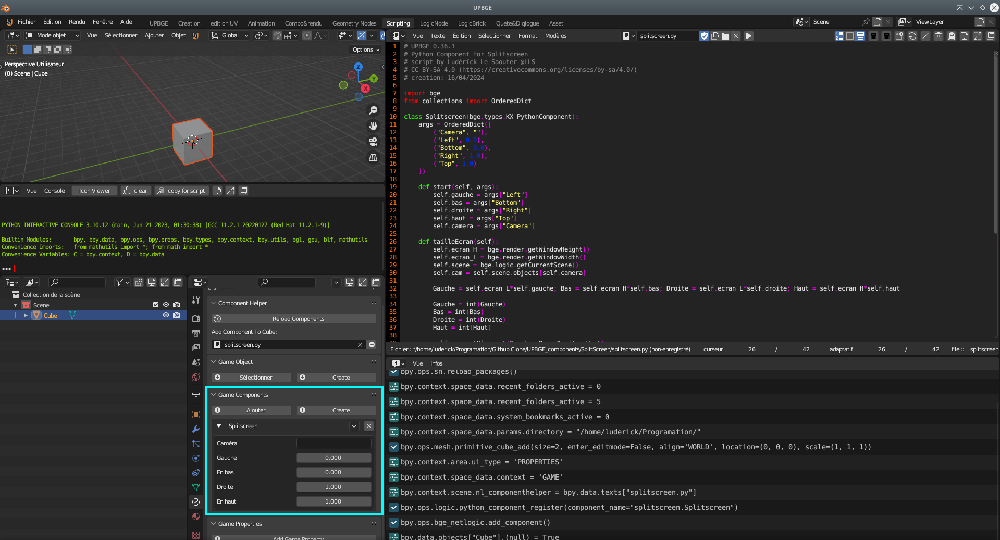

# UPBGE components

## Info

utilisation des components dans UPBGE

1) 

2) 

3) 

4) 

**ce principe s'applique à tous les scripts de type "PythonComponent"**

### Liste

- splitscreen (s'attache seulement au caméra) YT -> [Demo Splitscreen](https://www.youtube.com/watch?v=lLlS4wj2g2U)

---
- Lien vers mon Discord |-> [Discord-LLS-Lopos](https://discord.com/invite/mGK42pquT5)
- Lien vers le site UBPGE |-> [UPBGE](https://upbge.org/)
- Lien vers le Discord UPBGE officiel|-> [Discord-UPBGE](https://discord.gg/8PcrtTJW2R)
---
### License projet: [CC BY-SA 4.0](https://creativecommons.org/licenses/by-sa/4.0/)
